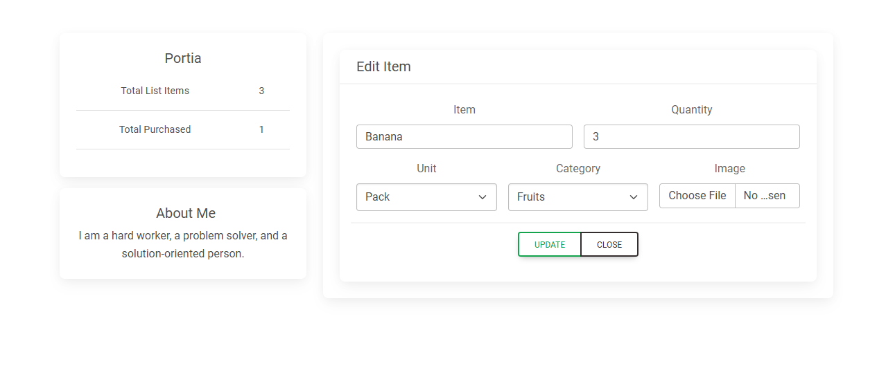
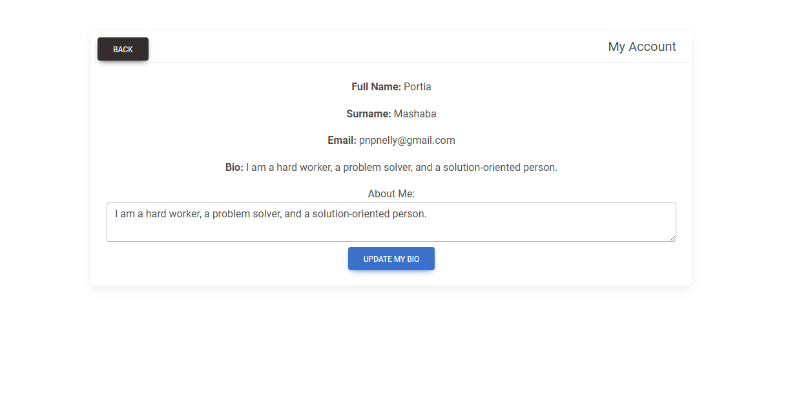

# Shopping List Application

This is a Shopping List App built using **React.js**, **Redux**, and **Material UI**. Users can register, log in, and manage their shopping lists effectively, including monitoring purchases, adding items, and utilizing CRUD functions.

## Features

### User Features:
1. **Home Page:**
   - A dashboard displaying:
     - Total number of items purchased.
     - Number of items added to the list.
   - A search box for filtering items.
   - A list of items with options to add, edit, or delete items.

2. **User Profile:**
   - Displays the logged-in user's name, surname, and email.
   - Option to edit or add a bio.
   - A logout button to sign out.

3. **Navigation Bar:**
   - Links for Home, Profile, and Logout.
   - Displays the username when logged in.

### Technology Stack
- **Frontend:** React.js
- **State Management:** Redux
- **UI Framework:** Material UI
- **Server:** Runs on port 5000

## Images






## Installation

To run this project locally, follow these steps:

1. Clone the repository:
   ```bash
   git clone https://github.com/Portia-Nelly-Mashaba/Redux-Shopping-List.git
   ```
2. Navigate to the project directory:
   ```bash
   cd shopping-list-app
   ```
3. Install dependencies:
   ```bash
   npm install
   ```
4. Run the application concurrently with the server:
   ```bash
   npm start
   ```

Make sure the server is configured to run on port 5000.

---
